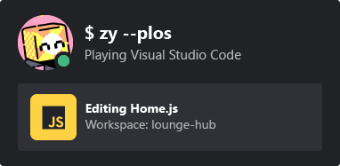
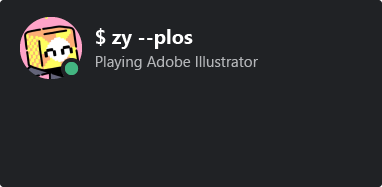
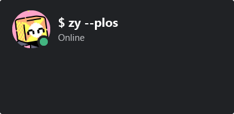
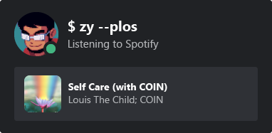

<h1 align="center">Discord README Badge</h1>

Working in an IDE with Rich Presence on? Show off what you're working on with a README badge! Comes as a svg you can add anywhere you'd like. Inspired by [kittinan/spotify-github-profile](https://github.com/kittinan/spotify-github-profile) and [anuraghazra/github-readme-stats](https://github.com/anuraghazra/github-readme-stats). Built by leveraging Vercel's serverless functions.

## Getting started

First off, you will need your Discord user ID. If you're unsure how to get your Discord user ID, follow [this guide](https://support.discord.com/hc/en-us/articles/206346498-Where-can-I-find-my-User-Server-Message-ID-).

In order to grab your Discord status and Rich Presence data, you will have to join [this discord server](https://discord.gg/MqSew5KzYp). For privacy's sake, there is no members list, you'll temporarily join a voice channel (where invites can be created). You can leave it when you join the Discord server.

Once you've joined, you can add a badge to your profile using this snippet:

```

```

It should look something like this:

<p></p>

## Card states

The card will only display certain games. Since this is meant to show off what you're working on, they are IDEs and creative programs. The full list of shown games can be found at [allowlistGames.js](./src/allowlistGames.js). If there are missing ones you would like to add, create a pull request.

> **Note**
> If you're adding something allowListGames.js, please write the program name in lowercase.

If the game you're playing does not have rich presence, it will look something like this:

<p></p>

If you're not playing anything, it will just show your status:

<p></p>

If you're listening to some tunes on Spotify, it will show what you're listening to:

<p></p>

## Project Setup

**This project depends on Vercel's serverless functions.** First install the Vercel CLI by doing `npm i -g vercel`.

If you'd like to run this project locally, you will first need a Discord bot account. You can create one by following [this guide](https://discordpy.readthedocs.io/en/stable/discord.html).

**Very important!** In Bots > Privileged Gateway Intents, make sure "Presence Intent" and "Server Members Intent" is enabled. The bot won't be able to get presence data without these enabled. Copy the bot token as you'll need it later.

This project also requires a Discord server where the bot will be. Invite the bot you made to a Discord server and copy that server's ID. Make sure the bot has permissions to see all members.

Once you have a bot account and a server with the bot in it, clone this repo and rename `.env.example` to `.env`, filling out the required values. Now open a command prompt and do the following command in the project directory:

```
vercel dev
```

On first start Vercel may ask you to link this project. Set it up and you should be greeted with:

```
Vercel CLI
> Ready! Available at http://localhost:3000
```

Go to `http://localhost:3000/api?id=<your discord user id>` and you should see this project working locally on your machine.
